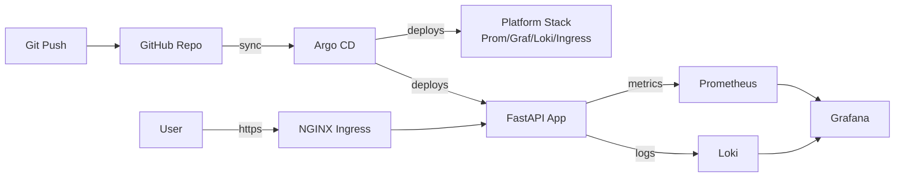

# k8s-gitops-platform

> Production-style **GitOps platform** running locally on **Docker Desktop (Kubernetes)** or **Kind**. Deploys a sample FastAPI microservice via **Argo CD**, with full observability (Prometheus, Grafana, Loki), Ingress, and cert-manager — all with a single `make demo`.

[](https://github.com/YOUR_USER/k8s-gitops-platform/actions)


---

## 🎯 What this demonstrates

- **GitOps** with **Argo CD** using the **app-of-apps** pattern (root Application syncs all child apps)
- **Kubernetes** cluster options: **Docker Desktop's built-in Kubernetes** (current default) or **Kind** (multi-node) — provisioned via Makefile
- **Helm + Kustomize** for platform + workload manifests
- **Observability**: Prometheus, Grafana (pre-built dashboards), Loki, OpenTelemetry
- **Ingress + TLS**: NGINX Ingress Controller + cert-manager (self-signed CA)
- **CI**: GitHub Actions with kubeconform, kube-linter, Trivy image scan
- **Sample app**: FastAPI service exposing `/metrics` and structured logs

## 🏗️ Architecture



## ⚡ Quickstart

**Prerequisites:** Docker Desktop (with Kubernetes enabled) **or** `kind`, plus `kubectl`, `helm`, `make`.

### Option A — Docker Desktop Kubernetes (current setup)

1. Docker Desktop → Settings → **Kubernetes** → *Enable Kubernetes* → Apply & Restart.
2. Confirm context:

	```bash
	kubectl config use-context docker-desktop
	kubectl get nodes
	```

3. Bootstrap Argo CD + all apps:

	```bash
	make argocd        # installs Argo CD into the argocd namespace
	make bootstrap     # applies the root app-of-apps (bootstrap/root-app.yaml)
	make urls          # prints Argo CD, Grafana, App URLs + credentials
	```

### Option B — Kind (multi-node)

```bash
make demo          # creates Kind cluster, installs Argo CD, bootstraps everything
make urls          # prints Argo CD, Grafana, App URLs + credentials
make destroy       # tear down
```

Then open:
- Argo CD  → https://argocd.localtest.me  (user: `admin`, password: `kubectl -n argocd get secret argocd-initial-admin-secret -o jsonpath="{.data.password}" | base64 -d`)
- Grafana  → https://grafana.localtest.me  (user: `admin`, password: `prom-operator`)
- App      → https://app.localtest.me

## 📁 Repository layout

```
├── Makefile                    # one-liner demo, lint, destroy
├── kind/cluster.yaml           # Kind cluster config (ingress-ready)
├── bootstrap/                  # Argo CD install + root app-of-apps
├── platform/                   # ingress, cert-manager, kube-prom-stack, loki
├── apps/
│   └── sample-fastapi/         # FastAPI microservice + Helm chart
├── .github/workflows/          # CI: lint, scan, validate manifests
└── docs/                       # architecture diagrams, decisions
```

## 🔑 Key engineering decisions

| Decision | Why |
|---|---|
| Argo CD app-of-apps | Single root app manages all others → true GitOps |
| Docker Desktop Kubernetes (default) | Zero-install on dev machines that already run Docker Desktop; single-node is enough for the demo |
| Kind (optional) | Faster startup than Minikube, supports true multi-node testing when needed |
| kube-prometheus-stack | Battle-tested, includes ServiceMonitor CRD |
| localtest.me DNS | No `/etc/hosts` edits needed for local demos |
| cert-manager self-signed | Realistic TLS flow without external DNS |

## � Deploying via Argo CD (GHCR → GitOps)

Once CI pushes the image to **GHCR**, follow these steps to complete the GitOps flow.

### 1. Make the GHCR image pullable

**Public package (easiest):** GitHub → Packages → your image → *Package settings* → **Change visibility → Public**. No pull secret needed.

**Private package:** create a GitHub PAT with `read:packages` and a pull secret in the target namespace:

```bash
kubectl create secret docker-registry ghcr-creds \
  --docker-server=ghcr.io \
  --docker-username=<github-user> \
  --docker-password=<PAT> \
  -n sample-fastapi
```

Then reference it in [apps/sample-fastapi/chart/values.yaml](apps/sample-fastapi/chart/values.yaml):

```yaml
imagePullSecrets:
  - name: ghcr-creds
```

### 2. Point the Helm chart at the GHCR image

In [apps/sample-fastapi/chart/values.yaml](apps/sample-fastapi/chart/values.yaml):

```yaml
image:
  repository: ghcr.io/<owner>/sample-fastapi
  tag: "sha-<commit>"
  pullPolicy: IfNotPresent
```

Ensure the Deployment template uses `{{ .Values.image.repository }}:{{ .Values.image.tag }}`.

### 3. Automate the image tag bump (GitOps write-back)

CI must commit the new tag back to Git so Argo CD can sync it. Pick one:

**Option A — CI writes the tag (simple):** add a step in [.github/workflows/ci.yml](.github/workflows/ci.yml) after the push job that uses `yq` to update `image.tag` in [apps/sample-fastapi/chart/values.yaml](apps/sample-fastapi/chart/values.yaml) and commits back to `main`.

**Option B — Argo CD Image Updater (recommended):** install [argocd-image-updater](https://argocd-image-updater.readthedocs.io/) and annotate the Application in [bootstrap/apps/10-sample-fastapi.yaml](bootstrap/apps/10-sample-fastapi.yaml):

```yaml
metadata:
  annotations:
    argocd-image-updater.argoproj.io/image-list: app=ghcr.io/<owner>/sample-fastapi
    argocd-image-updater.argoproj.io/app.update-strategy: newest-build
    argocd-image-updater.argoproj.io/write-back-method: git
```

### 4. Verify the Argo CD Application

Check [bootstrap/apps/10-sample-fastapi.yaml](bootstrap/apps/10-sample-fastapi.yaml) has:

- `syncPolicy.automated: { prune: true, selfHeal: true }`
- Correct `repoURL`, `path: apps/sample-fastapi/chart`, `targetRevision: HEAD`

### 5. End-to-end flow

1. Push code → CI builds & pushes `ghcr.io/<owner>/sample-fastapi:sha-abc123`
2. CI (or Image Updater) commits the new tag to [values.yaml](apps/sample-fastapi/chart/values.yaml)
3. Argo CD detects the Git change → syncs → rolls out new pods
4. Verify:

```bash
argocd app get sample-fastapi
kubectl -n sample-fastapi get pods -w
```

### 6. Nice-to-haves

- Kyverno/Gatekeeper policy to block `:latest`
- Argo CD notifications (Slack/Discord) on sync failures
- `ServiceMonitor`/`PodMonitor` so Prometheus scrapes the app
- Document lessons in [docs/LEARNINGS.md](docs/LEARNINGS.md)

## �📚 Learnings

See [docs/LEARNINGS.md](docs/LEARNINGS.md).

## 📝 License

MIT
