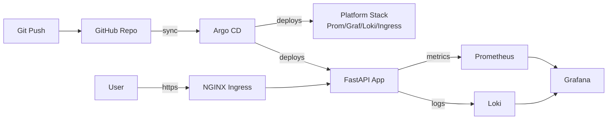

# k8s-gitops-platform

> Production-style **GitOps platform** running locally on Kind. Deploys a sample FastAPI microservice via **Argo CD**, with full observability (Prometheus, Grafana, Loki), Ingress, and cert-manager — all with a single `make demo`.

[](https://github.com/YOUR_USER/k8s-gitops-platform/actions)


---

## 🎯 What this demonstrates

- **GitOps** with Argo CD **app-of-apps** pattern
- **Kubernetes** cluster provisioning (Kind) via Makefile
- **Helm + Kustomize** for platform + workload manifests
- **Observability**: Prometheus, Grafana (pre-built dashboards), Loki, OpenTelemetry
- **Ingress + TLS**: NGINX Ingress Controller + cert-manager (self-signed CA)
- **CI**: GitHub Actions with kubeconform, kube-linter, Trivy image scan
- **Sample app**: FastAPI service exposing `/metrics` and structured logs

## 🏗️ Architecture



## ⚡ Quickstart

**Prerequisites:** Docker Desktop, `kind`, `kubectl`, `helm`, `make`.

```bash
make demo          # creates cluster, installs Argo CD, bootstraps everything
make urls          # prints Argo CD, Grafana, App URLs + credentials
make destroy       # tear down
```

Then open:
- Argo CD  → https://argocd.localtest.me
- Grafana  → https://grafana.localtest.me
- App      → https://app.localtest.me

## 📁 Repository layout

```
├── Makefile                    # one-liner demo, lint, destroy
├── kind/cluster.yaml           # Kind cluster config (ingress-ready)
├── bootstrap/                  # Argo CD install + root app-of-apps
├── platform/                   # ingress, cert-manager, kube-prom-stack, loki
├── apps/
│   └── sample-fastapi/         # FastAPI microservice + Helm chart
├── .github/workflows/          # CI: lint, scan, validate manifests
└── docs/                       # architecture diagrams, decisions
```

## 🔑 Key engineering decisions

| Decision | Why |
|---|---|
| Argo CD app-of-apps | Single root app manages all others → true GitOps |
| Kind over Minikube | Faster startup, better multi-node testing |
| kube-prometheus-stack | Battle-tested, includes ServiceMonitor CRD |
| localtest.me DNS | No `/etc/hosts` edits needed for local demos |
| cert-manager self-signed | Realistic TLS flow without external DNS |

## 📚 Learnings

See [docs/LEARNINGS.md](docs/LEARNINGS.md).

## 📝 License

MIT
